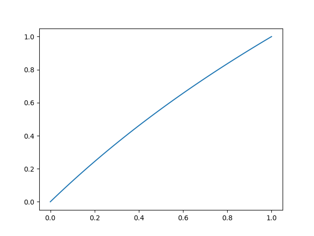
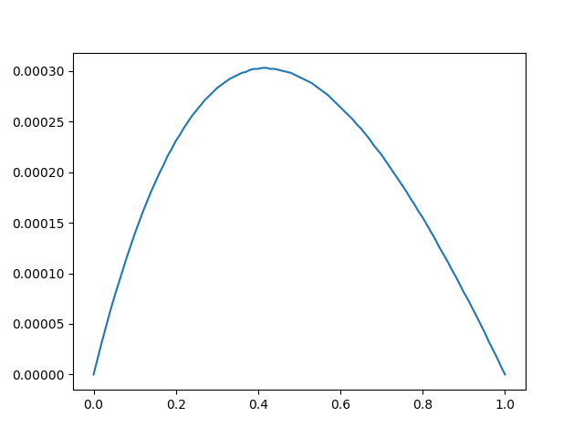

# 实验 6 解线性方程组的迭代法

2015011313 徐鉴劲 计54

## 实验要求

将微分方程转化为差分线性方程形式，然后采用Jacobi，Gauss-Seidel 法和 SOR法进行迭代求解。

真实函数如下图所示：



这是本次试验中需要解出的方程。

## 算法描述

由于这个微分方程的矩阵行与行之间存在着很大的相似性，所以不用将系数矩阵存起来。

首先我实现了G-S法，其他两种方法可以从这个方法的代码上进行变形：

```c
void GSIter(vector<double> &est_y, const linspace_t& b) {
    init_identity(est_y, b);

    double epsilon = 1, a = 0.5;
    double h = b.get_step();

    double a_ii = -(2 * epsilon + h);
    double left_coef = epsilon / (-a_ii);
    double right_coef = (epsilon + h) / (-a_ii);
    double bf = a * h * h / a_ii;
    int N = 10000, iter, i;

    for(iter = 0; iter < N; iter ++) {
        //est_y[0] = est_y[1] * right_coef + bf;
        for(i = 1; i < b.len; i++) {
            est_y[i] = left_coef * est_y[i-1] + right_coef * est_y[i+1] + bf;
        }
        //est_y[b.len] = left_coef * est_y[b.len - 1] + bf;
    }
}
```

首先我初始化目标解是y=x的直线，然后根据公式算出左边的系数（对应于$y_{i-1}$）和右边的系数（对应于$y_{i+1}$），加上的偏置，就得到了下一轮迭代的结果。值得注意的是，在代码中i是从小到大依次更新的，所以i+1中使用的上一个i的值实际上已经是下一个迭代的值了。

Jacobi法是记录上一次的值，在迭代的时候使用上一次的值，而不是这一次的值，其他都与G-S法一致。

SOR法的迭代代码基本上和G-S法一样，只用依据数学公式加上$\omega$系数就可以了。

## 实验结果

运行实验结果：

```
make
./main
```

输出的就是三种方法各自的误差。同时，方程的解被记录在了文件中，可以调用`python plot.py`画出对应的图像

首先我统计了三种方法的误差：单点最大误差，和总共加起来的绝对值误差。

Jacobi法使用20000次，G-S法使用10000次，SOR法使用5000次刚好达到这个误差，体现出了三种方法收敛的速度。

### Jacobi 法

Sum abs diff: 0.019866

Max diff: 0.000303

### G-S法

Sum abs diff: 0.019866

Max diff: 0.000303

### SOR法

Sum abs diff: 0.020038

Max diff: 0.000305

然后我画出了三种方法误差的分布，发现他们几乎完全一致，如下图所示，其实是三条误差线，但是他们完全重合了。
下图中横轴是自变量x，纵轴是误差。可以看见两边的误差为0（因为初始化在两端，是准确的），中间的误差最大。

