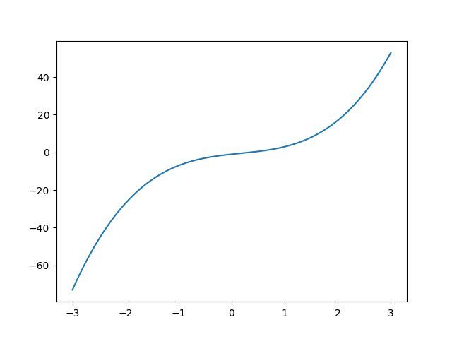
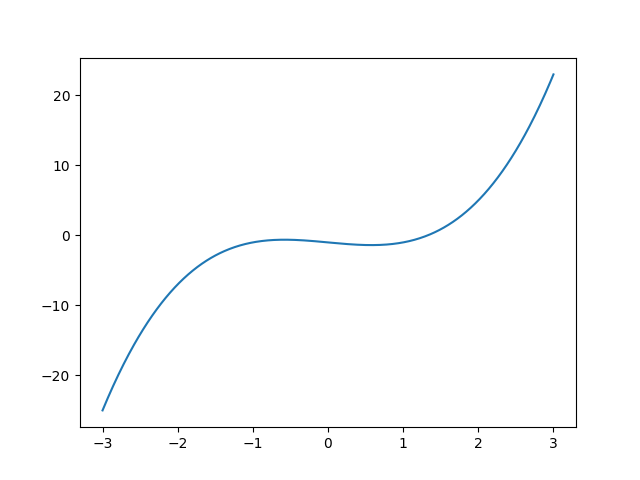

# 实验 7 非线性方程求根

2015011313 徐鉴劲 计54

## 实验目标

研究二分法、牛顿法、迭代法解方程的性质，在几个方程上进行了测试。

## 题目 1

求解方程 $2x^3-x ^ 2 + 3 x-1 = 0$在区间[-3, 3]上的根。

方程如图所示：



### 二分法

实现方法：

1. 首先要取一个区间，这个区间的两端符号要相反。

2. 然后判断这个区间中点的函数值是否满足了精度要求，如果是就要返回。

3. 如果不是，大于0正号端点就要收缩到中点，小于0负号端点就要收缩到中点。

4. 返回到第二步。

Iteration|x    |y      |
|:--|:--|:--|
|1      |0.00000        |-1.00000       |
|2      |1.50000        |8.00000        |
|3      |0.75000        |1.53125        |
|4      |0.37500        |0.08984        |
|5      |0.18750        |-0.45947       |
|6      |0.28125        |-0.19086       |
|7      |0.32812        |-0.05264       |
|8      |0.35156        |0.01799        |
|9      |0.33984        |-0.01746       |
|10     |0.34570        |0.00023        |
|11     |0.34277        |-0.00863       |
|12     |0.34424        |-0.00420       |
|13     |0.34497        |-0.00199       |
|14     |0.34534        |-0.00088       |
|15     |0.34552        |-0.00032       |
|16     |0.34561        |-0.00005       |
|17     |0.34566        |0.00009        |
|18     |0.34563        |0.00002        |
|19     |0.34562        |-0.00001       |
|20     |0.34563        |0.00000        |

Solution: x = 0.3456287384.

误差：e = 0.0000040727，在$10^{-6}$的级别。

### 牛顿法

实现方法：

1. 首先随机选取一个点。

2. 然后判断它是否满足精度要求，是就要返回。

3. 进行导数更新：$x -= \frac{f(x)}{f'(x)}$.

4. 返回到2.

|Iteration|x    |y      |
|:--|:--|:--|
|0      |3.00000        |53.00000       |
|1      |1.96078        |16.11484       |
|2      |1.23314        |4.92906        |
|3      |0.72275        |1.40096        |
|4      |0.42395        |0.24452        |
|5      |0.34826        |0.00798        |
|6      |0.34563        |0.00001        |

Solution: x = 0.3456298744.

误差：e = 0.0000075096，在$10^{-6}$级别。

### 分析

两种方法均能正确地找到解答，解答的具体数值上略有差别，在$10^{-6}$的级别。两种方法在解法精度上都是$10^{-6}$的级别，具体数值上略有不同。

## 题目 2(1)

实现非常简单，迭代每一次的x就可以了。

### 方案一：

|Iteration|x    |func   |y      |
|:--|:--|:--|:--|
|0      |0.00000|0.79370|-1.00000|
|1      |0.79370|0.96436|-0.79370|
|2      |0.96436|0.99402|-0.17066|
|3      |0.99402|0.99900|-0.02966|
|4      |0.99900|0.99983|-0.00498|
|5      |0.99983|0.99997|-0.00083|
|6      |0.99997|1.00000|-0.00014|
|7      |1.00000|1.00000|-0.00002|
|8      |1.00000|1.00000|-0.00000|
|9      |1.00000|1.00000|-0.00000|

Solution: x=0.9999999786

### 方案二：

|Iteration|x    |func   |y      |
|:--|:--|:--|:--|
|0      |0.00000|-1.00000|-1.00000|
|1      |-1.00000|-3.00000|-2.00000|
|2      |-3.00000|-55.00000|-52.00000|
|3      |-55.00000|-332751.00000|-332696.00000|
|...    |inf    |inf    |inf    |

第一种迭代方案收敛性良好，找到了方程的解。第二种方法则不收敛。

第一种方案满足李普希兹条件，不动点存在、唯一且迭代算法稳定。

第二种方案中的函数不满足这个条件（导数大于1了），迭代算法不能稳定找到不动点。

## 题目2（2）

用牛顿法的不同初值求方程$2 x^3 - x - 1 = 0$的在1.5附近的根。

方程如图所示：




### 方案一：初始化是1.5.

|Iteration|x    |y      |
|:--|:--|:--|
|0      |1.50000        |0.87500        |
|1      |1.34783        |0.10068        |
|2      |1.32520        |0.00206        |
|3      |1.32472        |0.00000        |


Solution: x=1.3247181740

Error: 0.0000009244


### 方案二：初始化是0.

|Iteration|x    |y      |
|:--|:--|:--|
|0      |0.00000        |-1.00000       |
|1      |-1.00000       |-1.00000       |
|2      |-0.50000       |-0.62500       |
|3      |-3.00000       |-25.00000      |
|4      |-2.03846       |-7.43201       |
|5      |-1.39028       |-2.29697       |
|6      |-0.91161       |-0.84597       |
|7      |-0.34503       |-0.69605       |
|8      |-1.42775       |-2.48268       |
|9      |-0.94242       |-0.89459       |
|10     |-0.40495       |-0.66146       |
|11     |-1.70690       |-4.26620       |
|12     |-1.15576       |-1.38807       |
|13     |-0.69419       |-0.64034       |
|14     |0.74249        |-1.33316       |
|15     |2.78130        |17.73372       |
|16     |1.98273        |4.81176        |
|17     |1.53693        |1.09352        |
|18     |1.35726        |0.14303        |
|19     |1.32566        |0.00403        |
|20     |1.32472        |0.00000        |


Solution: x=1.3247187886

Error: 0.0000035455

### 分析

在本题目中，初始值取1.5就是非常好的结果，收敛得又快又准。初始值取0却经历了大幅度的震荡，经过很长一段很长的迭代才找到解答。

牛顿法对于初值十分敏感，不同初始化值会导致完全不一样的收敛特性。

而且牛顿法是不可预测的，在一些情况中，它会接近到极值点上，这是再求斜率就是一个病态问题了，直线的倾斜角会很平，导致最终更新出来的x可能非常非常巨大。

## 复现代码的结果

```
mkdir data
make
build/main
python src/plot.py
```