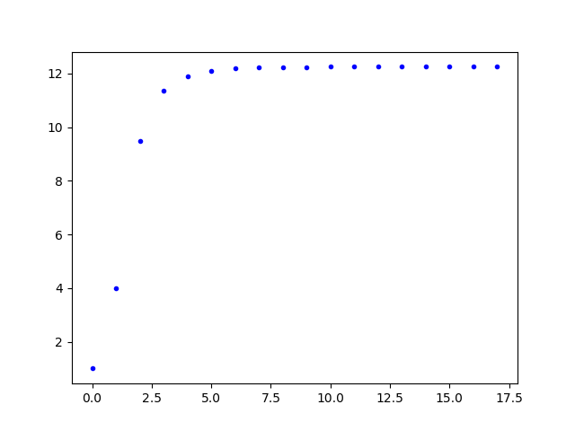
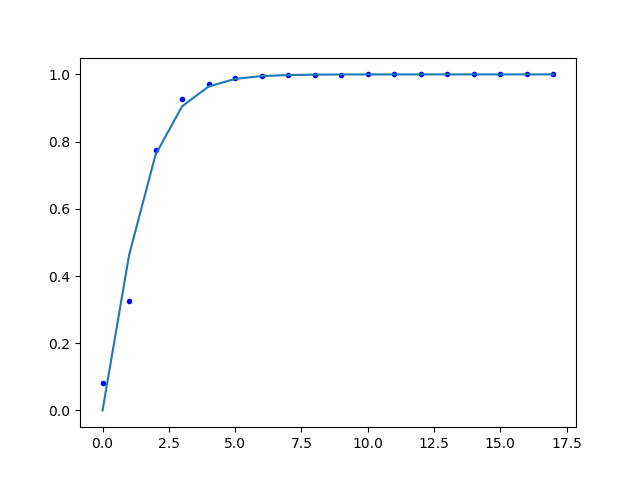
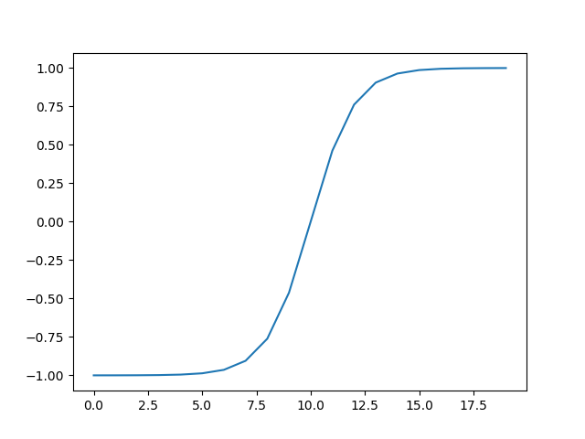
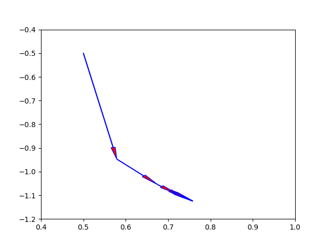
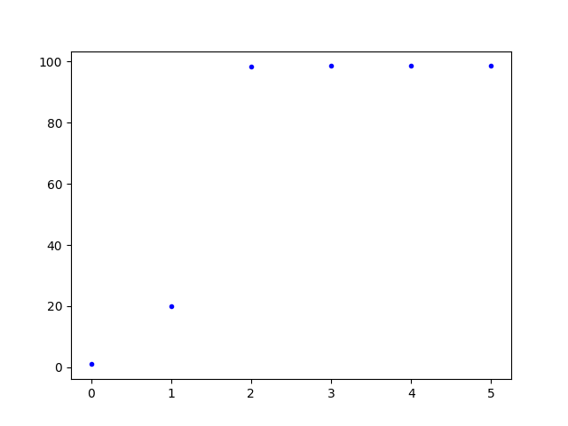

# 实验 8 矩阵特征值计算

2015011313 徐鉴劲 计54

## 实验目的

1. 实现幂法。

2. 通过幂法求两个矩阵的最大特征值和对应的特征向量。

两个矩阵分别是：

```
5 -4 1
-4 6 -4
1 -4 7
```

和

```
25 -41 10 -6
-41 68 -17 10
10 -17 5 -3
-6 10 -3 2
```

## 实验思路

幂法的原理是：一个归一化向量在A的幂矩阵下将追减趋向于最大特征值对应的向量，而其对应的非归一化向量的最大值就是这个最大特征值。

证明的方法就是将这个向量表示称所有特征值的线性组合，其中最大的特征值会将其余特征向量都衰减到小向量，从而凸显出自身的存在。

我实现的代码主要在`main.cpp`中，流程图如下：

- 首先调用`init_vector`初始化一个向量。

- 然后调用`power_vector`对这个向量不断用进行幂矩阵乘。这个函数的流程又可以细化为：

不断地迭代：

1. 调用`matrix_vector_v`进行迭代相乘，产生非归一化向量。

2. 调用`normalize_u`，对向量进行归一化，同时返回这个向量的最大值。

3. 判断误差是否满足（前一个最大值和现在最大值的差小于$10^{-5}$）。

## 实验结果

通过运行

```
make
build/main
python src/plot1.py
python src/plot2.py
```

可以的到下面的结果。

### 矩阵 1

实验得到的最大特征值和特征向量是：

$\lambda_1 = 12.2543123837$，$x = (0.7577021766,-1.1241530641,1.0000000000)$。

经过numpy包中linalg.eig函数的验证，这个结果是正确的。

迭代的过程可以画成如下的图表：

#### 特征值迭代过程

|原始特征值变化图|归一化特征值与Sigmoid函数|伸缩后的Sigmoid函数|
|:--|:--|:--|
||||

图像中横坐标是迭代数，纵坐标是计算出的特征值。

通过观察原始特征值变化图（左1），可以看出特征值的收敛是非常稳定的。

进而我发现这个特征是变化非常类似于生物学中的logistic过程，或者是一个sigmoid函数：$\sigma(x) = \frac{1}{1+e^{-x}}$。

在中间的图像中，我将一个伸缩平移以后的sigmoid图像放在了归一化以后的特征值上（就是将序列中的特征值除以最终算出来的特征值），发现匹配得非常完美。

这个伸缩平移实际上就是把sigmoid的中心放在了(0, 0)的位置上，并使得这个函数的值域从(0, 1)变成了(-1, 1)。具体的表达式是$y = 2\sigma(x) - 1$。这个函数的完整图像如右图所示。

这个结果说明迭代过程可以用一个精确的数学模型描述出来，由于时间原因，在此仅仅是提出这样一种猜想。

#### 向量迭代过程



在这张图中，向量的变化过程也被可视化了，用箭头表示这个向量的变化过程。在实际的模拟过程中，由于向量的z分量始终是1，所以这里恰好用一个二维平面将这个向量可视化出来了。

有意思的是，向量的变化方向改变并不大。在第二次迭代的时候，向量实际上已经锁定了一个变化的方向，接下来的变化都只是沿着这个方向进行移动而已。而且，这种移动还十分缓慢，形成了很多箭头重叠的样子。

这说明了目前迭代的过程还有可以加速的空间，比如确定了方向以后可以更快的收敛到更高的精度中。

#### 详细迭代过程

|迭代数|最大值|$x_0$|$x_1$|$x_2$|
|:--|:--|:--|:--|:--|
| 0 | 1.0000000000   |1.0000000000   |1.0000000000   |1.0000000000   |
| 1 | 4.0000000000   |0.5000000000   |-0.5000000000  |1.0000000000   |
| 2 | 9.5000000000   |0.5789473684   |-0.9473684211  |1.0000000000   |
| 3 | 11.3684210526  |0.6759259259   |-1.0555555556  |1.0000000000   |
| 4 | 11.8981481481  |0.7229571984   |-1.0957198444  |1.0000000000   |
| 5 | 12.1058365759  |0.7432501929   |-1.1123682181  |1.0000000000   |
| 6 | 12.1927230651  |0.7517372278   |-1.1192914009  |1.0000000000   |
| 7 | 12.2289028312  |0.7552477822   |-1.1221527807  |1.0000000000   |
| 8 | 12.2438589048  |0.7566936295   |-1.1233311262  |1.0000000000   |
| 9 | 12.2500181344  |0.7572880751   |-1.1238155833  |1.0000000000   |
| 10        | 12.2525504083  |0.7575323014   |-1.1240146207  |1.0000000000   |
| 11        | 12.2535907843  |0.7576326118   |-1.1240963708  |1.0000000000   |
| 12        | 12.2540180950  |0.7576738071   |-1.1241299438  |1.0000000000   |
| 13        | 12.2541935821  |0.7576907243   |-1.1241437308  |1.0000000000   |
| 14        | 12.2542656473  |0.7576976713   |-1.1241493924  |1.0000000000   |
| 15        | 12.2542952409  |0.7577005241   |-1.1241517173  |1.0000000000   |
| 16        | 12.2543073933  |0.7577016955   |-1.1241526720  |1.0000000000   |
| 16        | 12.2543123837  |0.7577021766   |-1.1241530641  |1.0000000000   |

初始化向量是（1，1，1），在16轮迭代的时候就已经满足了精度要求。

### 矩阵 2

这个矩阵的最大特征值是$\lambda_1 = 98.5216977238$，对应的特征向量是$x =(-0.6039723423, 1.0000000000, -0.2511351305, 0.1489534456)$。 

这个矩阵的收敛速度要快上很多，这是它特征值的变化过程：



可见特征值很快达到了最优解，迭代数量很少。

|迭代数|最大值|$x_0$|$x_1$|$x_2$|$x_3$|
|:--|:--|:--|:--|:--|:--|
| 0 | 1.0000000000   |1.0000000000   |1.0000000000   |1.0000000000   |1.0000000000   |
| 1 | 20.0000000000  |-0.6000000000  |1.0000000000   |-0.2500000000  |0.1500000000   |
| 2 | 98.3500000000  |-0.6039654296  |1.0000000000   |-0.2511438739  |0.1489578038   |
| 3 | 98.5216065074  |-0.6039723002  |1.0000000000   |-0.2511352378  |0.1489535172   |
| 4 | 98.5216985221  |-0.6039723419  |1.0000000000   |-0.2511351318  |0.1489534465   |

## 体会

在这一次看似普通的实验中，我发现了特征值在训练过程中似乎还隐藏着一些规律。我在完成了基本正确性的验证之后并没有停止，而是进而详细地验证就这个算法是如何产生这个结果的，通过将训练过程可视化发现了特征值变化中隐藏的规律。我继续大胆猜想，通过简单的Sigmoid平移拟合出了训练图像。

这点小小的惊喜给我的学习带来了更大的乐趣与动力，如果以后有机会，我想我会详细查阅资料，继续研究训练过程的数学模型。